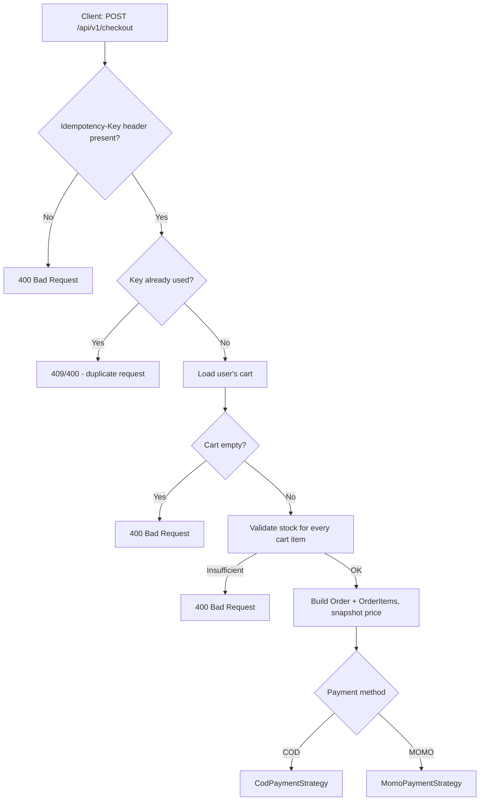
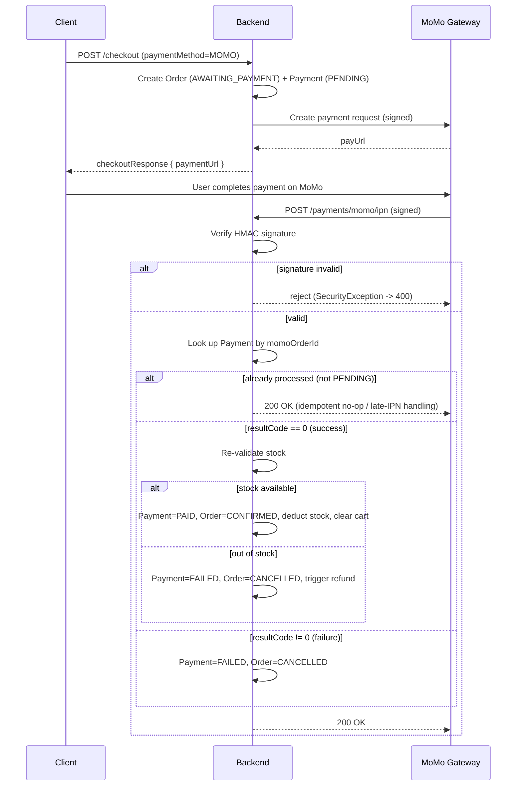
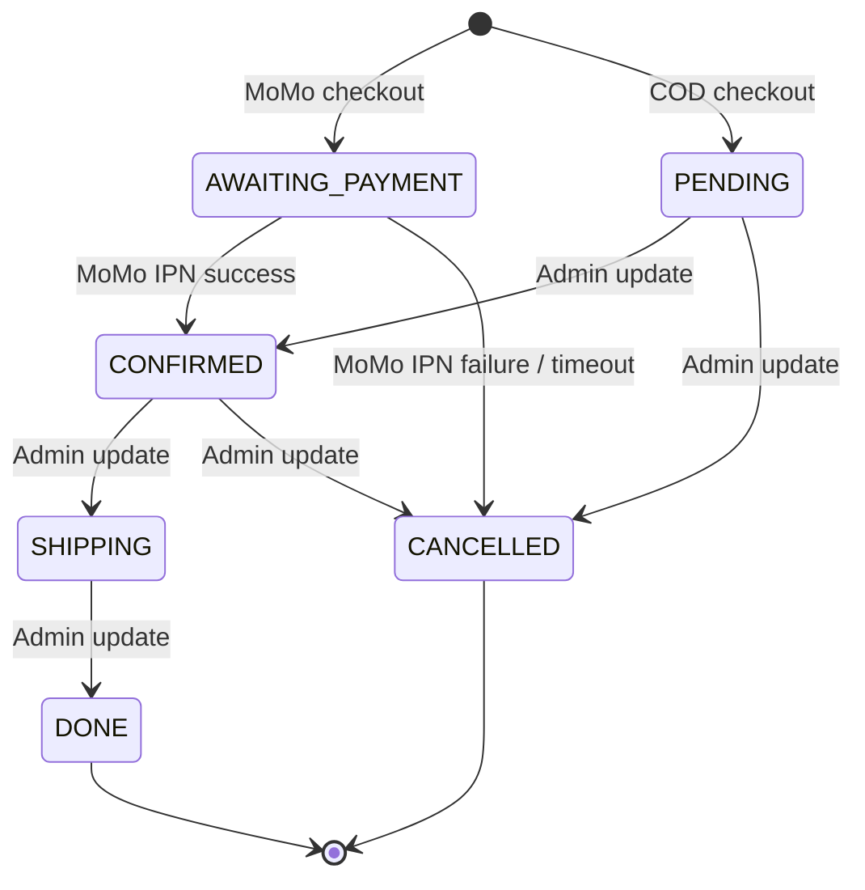
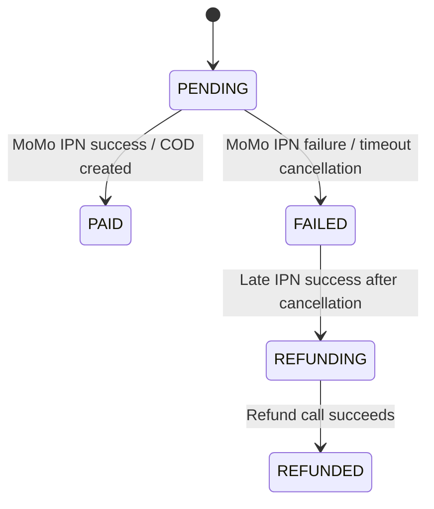
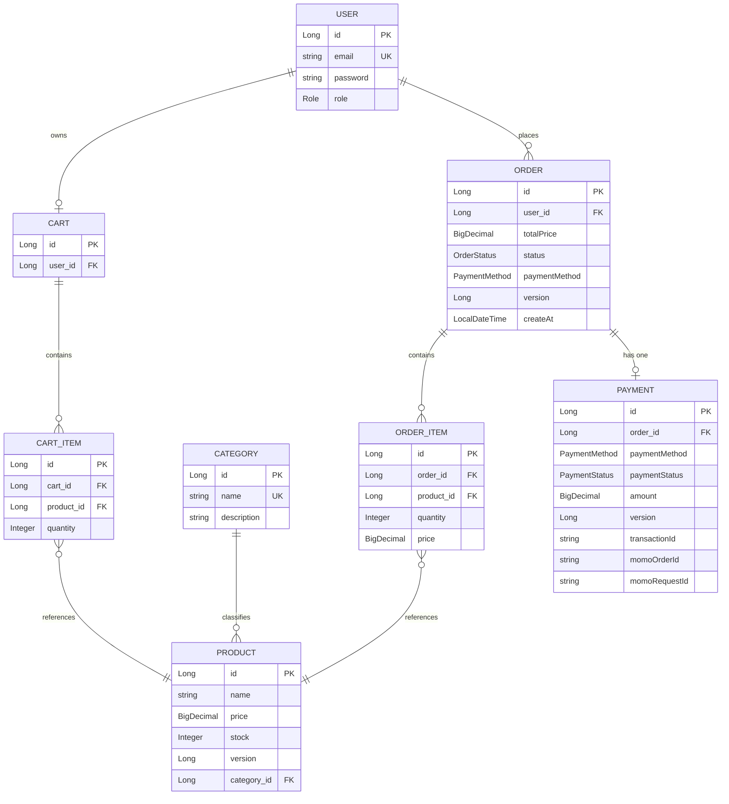

# E-Commerce Backend (Spring Boot)

A backend REST API for an e-commerce platform, built with **Spring Boot 3 / Java 21**. It covers the core commerce flow — authentication, product catalog, shopping cart, checkout, order lifecycle, and payment processing (Cash on Delivery and MoMo) — with a focus on **transactional correctness, concurrency safety, and idempotency** rather than a large surface of features.

A minimal React (Vite) frontend is included in `frontend/` to exercise the API, but this README documents the backend, which is the core of the project.

---

## Table of Contents

- [Project Overview](#project-overview)
- [Key Features](#key-features)
- [Tech Stack](#tech-stack)
- [Architecture](#architecture)
- [Business Flows](#business-flows)
- [Concurrency & Data Consistency](#concurrency--data-consistency)
- [Idempotency](#idempotency)
- [Payment & Refund](#payment--refund)
- [Security](#security)
- [Database](#database)
- [API Overview](#api-overview)
- [Error Handling](#error-handling)
- [Testing](#testing)
- [Docker / Deployment](#docker--deployment)
- [Project Structure](#project-structure)
- [Local Development](#local-development)
- [Environment Variables](#environment-variables)
- [API Documentation](#api-documentation)
- [Limitations & Future Improvements](#limitations--future-improvements)

---

## Project Overview

The system models a small single-vendor online store. There are two actors:

- **Customer (`USER`)** — registers/logs in, browses products, manages a cart, checks out (COD or MoMo), and views their own order/payment history.
- **Administrator (`ADMIN`)** — manages the product catalog and categories, and updates order statuses.

The main business flow is: browse products → add items to cart → checkout → an `Order` and a `Payment` are created → for COD the order is confirmed immediately and stock is deducted; for MoMo the order waits for an asynchronous payment confirmation (IPN) from the payment gateway before stock is deducted and the order is confirmed. Unpaid MoMo orders are automatically expired by a scheduled job.

## Key Features

### Authentication & Authorization
- Registration and login with email/password (BCrypt password hashing).
- JWT access tokens (default 15 min) and refresh tokens (default 7 days), issued via `AuthController` and validated by a custom `JwtAuthenticationFilter`.
- Refresh-token endpoint to obtain a new access token.
- Role-based authorization (`USER`, `ADMIN`) enforced by Spring Security (`SecurityConfig`).

### Product & Inventory
- CRUD for products and categories, with pagination and sorting on listing endpoints.
- Product listing can be filtered by `categoryId`.
- Stock is tracked per product and validated at every point it's consumed (add-to-cart, checkout, MoMo IPN confirmation).
- Response caching for `GET` product-by-id and category listing endpoints (Caffeine), invalidated on writes.

### Shopping Cart
- One cart per user, created lazily on first access.
- Add-to-cart merges quantities into an existing line item and re-validates against current stock.
- Remove individual cart items.

### Order Management
- Orders are created from the cart at checkout, snapshotting product price and quantity into `OrderItem`.
- Paginated order history per user.
- Admin-only endpoint to transition order status, with restocking logic when an order that had already deducted stock is cancelled.

### Payment
- Two payment methods via a **Strategy pattern**: `COD` and `MOMO`.
- MoMo integration: payment-URL creation, redirect-return handling, and server-to-server IPN (Instant Payment Notification) callback with HMAC-SHA256 signature verification.
- Payment status lookup by order id, restricted to the owning user.

### Admin Management
- Category and product management (create/update/delete) restricted to `ADMIN`.
- Order status updates restricted to `ADMIN`.

### Security
- Stateless JWT authentication, BCrypt password hashing, endpoint-level role restrictions, ownership checks on payment lookup, and HMAC signature verification on the MoMo IPN endpoint.

### Reliability & Concurrency
- Optimistic locking (`@Version`) on `Product`, `Order`, and `Payment` to prevent lost updates under concurrent checkout/stock changes.
- A scheduled job cancels MoMo orders left unpaid beyond a timeout window.
- Late/duplicate IPN callbacks are handled explicitly, including a "paid after cancellation" case that triggers an automatic refund flow.

### Testing
- 112 JUnit 5 tests across unit and integration suites, including dedicated concurrency tests using multi-threaded `ExecutorService` scenarios.

---

## Tech Stack

| Category | Technology |
|---|---|
| Language | Java 21 |
| Framework | Spring Boot 3.5 |
| Web | Spring Web (MVC), Bean Validation (`spring-boot-starter-validation`) |
| Persistence | Spring Data JPA / Hibernate |
| Database | PostgreSQL (H2 in-memory for tests) |
| Security | Spring Security, JWT (`jjwt` 0.12.7) |
| Caching | Spring Cache + Caffeine |
| API Docs | springdoc-openapi (Swagger UI) |
| Build Tool | Maven (with Maven Wrapper) |
| Testing | JUnit 5, Mockito, Spring Boot Test, MockMvc, H2 |
| Containerization | Docker (multi-stage build) |
| CI | GitHub Actions (Maven build + test) |
| Utilities | Lombok |

## Architecture

The backend follows a classic **layered architecture**:

```
Controller  →  Service  →  Repository  →  Database
   (REST)     (business)     (JPA)       (PostgreSQL)
```

- **Controller** — REST endpoints, request/response mapping, delegates all business logic to services (`AuthController`, `ProductController`, `CartController`, `CheckoutController`, `OrderController`, `PaymentController`, `CategoryController`).
- **Service** — transactional business logic (`@Transactional`), validation of business rules (stock checks, order state transitions), orchestration between repositories and external services.
- **Repository** — Spring Data JPA interfaces for persistence access.
- **Entity** — JPA entities mapping directly to database tables.
- **DTO + Mapper** — request/response objects are decoupled from entities via dedicated mapper classes (`ProductMapper`, `OrderMapper`, `PaymentMapper`, `CartMapper`, `CategoryMapper`, `UserMapper`), so entities are never exposed directly over the API.

### Design patterns actually implemented

- **Strategy Pattern** — `PaymentStrategy` interface with `CodPaymentStrategy` and `MomoPaymentStrategy` implementations, selected at runtime by `PaymentStrategyFactory` based on `PaymentMethod`. `CheckoutService` is unaware of payment-method-specific logic.
- **Factory Pattern** — `PaymentStrategyFactory` resolves the correct strategy for a given payment method.
- **DTO Pattern** — all controllers accept/return DTOs, never entities.
- **Dependency Injection** — constructor injection throughout, via Lombok's `@RequiredArgsConstructor`.
- **Transactional Service Layer** — service methods are the transaction boundary (`@Transactional`), with some flows (refund, order-timeout cancellation) explicitly using `Propagation.REQUIRES_NEW` to isolate side-effect transactions from the caller's transaction.
- **Interceptor Pattern** — `IdempotencyInterceptor` implements `HandlerInterceptor`, applied globally via `WebMvcConfig`, and activates only on methods annotated with a custom `@Idempotent` annotation.

## Business Flows

### Checkout Flow



- **COD**: order set to `PENDING`, `Payment` created as `PENDING`, stock is deducted immediately, cart is cleared. No external API call.
- **MOMO**: order set to `AWAITING_PAYMENT`, `Payment` created as `PENDING`, a MoMo payment URL is requested from the MoMo gateway. Stock is **not** deducted and the cart is **not** cleared yet — both happen only after a successful IPN callback.

### MoMo Payment Flow



If no IPN arrives, `PaymentTimeoutScheduler` runs every 5 minutes and cancels any `MOMO` order still `AWAITING_PAYMENT` after 15 minutes (`OrderCancellationService`, run in its own transaction).

### Order Lifecycle



`OrderStatus` values found in code: `AWAITING_PAYMENT`, `PENDING`, `CONFIRMED`, `SHIPPING`, `DONE`, `CANCELLED`. `DONE` and `CANCELLED` are terminal — `OrderService.updateOrderStatus` rejects any further transition once an order reaches either state. Cancelling an order that had already deducted stock (i.e. not `AWAITING_PAYMENT`) restocks each product.

### Payment Lifecycle



`PaymentStatus` values found in code: `PENDING`, `PAID`, `FAILED`, `REFUNDING`, `REFUNDED`. Note that for COD, `Payment` is created as `PENDING` and there is no code path in this project that transitions a COD payment to `PAID` — see [Limitations](#limitations--future-improvements).

## Concurrency & Data Consistency

- `Product`, `Order`, and `Payment` all carry a `@Version` column, so Hibernate uses **optimistic locking**. Concurrent writers to the same row (e.g., two checkouts decrementing the same product's stock) will have one succeed and the other fail with `ObjectOptimisticLockingFailureException` / `OptimisticLockException`.
- `GlobalExceptionHandler` maps both of those exceptions to **HTTP 409 Conflict** with a user-facing message ("The product is being purchased by another customer at the same time. Please try again!").
- This is verified by dedicated concurrency tests (`ProductConcurrencyTest`, `OrderConcurrencyTest`) that spin up multiple threads via `ExecutorService`/`CountDownLatch` to race checkout/stock-update operations and assert that exactly one wins and final stock is consistent.
- The project does **not** use pessimistic locking (`SELECT ... FOR UPDATE`) anywhere in the codebase — concurrency safety relies entirely on optimistic locking plus retried/rejected client requests.
- Side-effect operations that must survive/be isolated from the caller's transaction (order-timeout cancellation, refund processing) run in `Propagation.REQUIRES_NEW` transactions.
- The unique DB constraint `(cart_id, product_id)` on `cart_items` and a unique constraint on `category.name` add a second layer of consistency enforced at the database level, surfaced as HTTP 409 via `DataIntegrityViolationException` handling.

## Idempotency

Duplicate checkout requests (e.g., a user double-clicking "Place Order", or a client retry after a timeout) are prevented as follows:

- `CheckoutController.checkout` is annotated `@Idempotent` and requires an `Idempotency-Key` request header.
- `IdempotencyInterceptor` (a `HandlerInterceptor` registered for `/api/**`) rejects the request with **400 Bad Request** if the header is missing on an `@Idempotent` endpoint. It does **not** itself check for duplicates — it only enforces the header's presence.
- The actual duplicate-detection happens in `CheckoutService.checkout`: the key is inserted into an `idempotency_keys` table (`id` is the primary key = the key value) using `saveAndFlush`. If the key already exists, a `DataIntegrityViolationException` is thrown by the database and caught, and the service raises `IllegalStateException("Request is already processing or completed")`, mapped to **400 Bad Request**.
- Because the key is written and flushed **before** any order/payment logic runs, and the primary-key uniqueness is enforced by PostgreSQL, this closes the race window even under concurrent identical requests — the second insert simply fails at the database level.
- **IPN idempotency** is handled separately, inside `MomoIpnService.handleIpn`: if a `Payment` is no longer `PENDING` when an IPN arrives, the callback is treated as a duplicate/late IPN and is either ignored (already `PAID`/`REFUNDED`/`REFUNDING`) or triggers a refund (payment succeeded on MoMo's side after the order had already been auto-cancelled as `FAILED`).

There is no cleanup/expiry job for old rows in `idempotency_keys` — see [Limitations](#limitations--future-improvements).

## Payment & Refund

**Implemented:**
- COD and MoMo as payment methods (`PaymentMethod` enum).
- MoMo payment-URL creation (`payWithMethod` request type) with HMAC-SHA256 request signing.
- MoMo IPN handling with HMAC-SHA256 signature verification (`MomoServiceImpl.verifySignature`) before trusting any callback payload.
- A separate MoMo "return URL" endpoint (`GET /payments/momo/return`) that only reflects the result to the browser after redirect — it does **not** update any state; state changes happen exclusively through the IPN endpoint.
- Timeout-based auto-cancellation for MoMo orders left unpaid for 15 minutes (`PaymentTimeoutScheduler`, every 5 minutes).
- An automatic refund trigger (`PaymentRefundService.processRefund`) for two specific edge cases: (1) a late successful IPN arriving after the order was already auto-cancelled, and (2) a successful IPN where stock turned out to be insufficient by the time it was processed.

**Partially implemented:**
- `MomoService.refundPayment` — the refund **state machine** (`PENDING → REFUNDING → REFUNDED`) and its triggers are fully implemented and tested, but the actual call to MoMo's refund API is **stubbed**: `MomoServiceImpl.refundPayment` only logs the intended refund and does not perform a real HTTP call to MoMo. This should not be presented as "MoMo refund API integrated" — the orchestration logic is real, the outbound API call is a placeholder.
- COD payment status: `Payment` for a COD order is created and stays `PENDING`; the codebase has no endpoint or scheduled logic that marks a COD payment `PAID` (e.g., on delivery/collection). Only the `Order.status` progresses for COD orders.

**Not implemented:**
- User-initiated cancellation or refund requests (all refund triggers are system-initiated, not user-facing).
- Partial refunds/partial payments.

## Security

- **Authentication**: JWT (HS256, `jjwt` library), issued on register/login, validated on every request via `JwtAuthenticationFilter` (a `OncePerRequestFilter`), stateless sessions (`SessionCreationPolicy.STATELESS`).
- **Password storage**: BCrypt (`BCryptPasswordEncoder`).
- **Authorization**: role-based, enforced declaratively in `SecurityConfig` (e.g., product/category writes and order-status updates require `ADMIN`; MoMo IPN/return and auth endpoints are public; everything else requires authentication).
- **Ownership checks**: `PaymentController.getPaymentByOrderId` checks that the authenticated principal's email matches the order owner's email before returning payment details (403 otherwise).
- **IPN authenticity**: the MoMo IPN endpoint has no JWT (MoMo is a server-to-server caller with no user token) — instead, every callback's HMAC-SHA256 signature is recomputed server-side and compared; a mismatch raises a `SecurityException` mapped to 400.
- **Input validation**: Bean Validation (`@Valid`, `@NotNull`, `@Min`, `@Email`, etc.) on all request DTOs, with structured validation-error responses.
- **CSRF**: disabled, appropriate for a stateless, token-authenticated REST API.
- Secrets (JWT signing key, MoMo keys, DB credentials) are injected via environment variables / `.env` files, which are git-ignored; only `.env.example` / `.env.prod.example` (placeholder values) are committed.

## Database

Core entities and relationships, as defined by the JPA entity classes:



`cart_items` has a unique constraint on `(cart_id, product_id)`; `categories.name` and `users.email` are unique; `idempotency_keys` uses the idempotency key string itself as the primary key. `ddl-auto: update` is used (Hibernate auto-generates/updates the schema) — there are no separate SQL migration files (e.g. Flyway/Liquibase) in the project.

## API Overview

Base path: `/api/v1`. All endpoints below are read directly from the controllers.

### Authentication (`/auth`) — public
| Method | Endpoint | Purpose |
|---|---|---|
| POST | `/auth/register` | Register a new user, returns access + refresh token |
| POST | `/auth/login` | Authenticate, returns access + refresh token |
| POST | `/auth/refresh` | Exchange a valid refresh token for a new access token |

### Products (`/products`)
| Method | Endpoint | Purpose | Auth |
|---|---|---|---|
| GET | `/products` | Paginated list, optional `categoryId`, sort params | Public |
| GET | `/products/{id}` | Product detail (cached) | Public |
| POST | `/products` | Create product | ADMIN |
| PUT | `/products/{id}` | Update product | ADMIN |
| DELETE | `/products/{id}` | Delete product | ADMIN |

### Categories (`/categories`)
| Method | Endpoint | Purpose | Auth |
|---|---|---|---|
| GET | `/categories` | List all (cached) | Public |
| GET | `/categories/{id}` | Category detail | Public |
| POST | `/categories` | Create category | ADMIN |
| PUT | `/categories/{id}` | Update category | ADMIN |
| DELETE | `/categories/{id}` | Delete category | ADMIN |

### Cart (`/carts`) — authenticated user
| Method | Endpoint | Purpose |
|---|---|---|
| GET | `/carts` | Get current user's cart |
| POST | `/carts/add` | Add item / merge quantity |
| DELETE | `/carts/{itemId}` | Remove a cart item |

### Checkout (`/checkout`) — authenticated user
| Method | Endpoint | Purpose |
|---|---|---|
| POST | `/checkout` | Create order + payment from cart. Requires `Idempotency-Key` header |

### Orders (`/orders`)
| Method | Endpoint | Purpose | Auth |
|---|---|---|---|
| GET | `/orders` | Paginated order history for current user | Authenticated |
| PATCH | `/orders/{id}/status` | Update order status | ADMIN |

### Payments (`/payments`)
| Method | Endpoint | Purpose | Auth |
|---|---|---|---|
| POST | `/payments/momo/ipn` | MoMo server-to-server callback (signature-verified) | Public (signed) |
| GET | `/payments/momo/return` | Browser redirect result display only | Public |
| GET | `/payments/order/{orderId}` | Get payment status for an order (owner only) | Authenticated |

## Error Handling

Centralized in `GlobalExceptionHandler` (`@RestControllerAdvice`), returning a consistent JSON error body (`timestamp`, `status`, `error`, `message`):

| Status | Trigger |
|---|---|
| 400 | Bean Validation failures, `IllegalArgumentException`/`IllegalStateException` (empty cart, insufficient stock, duplicate idempotency key, invalid order-status transition), invalid MoMo signature |
| 401 | Bad credentials, invalid/expired JWT |
| 402 | `PaymentException` (MoMo gateway/API failure) |
| 403 | Manual check in `PaymentController` for non-owner payment access |
| 404 | `ResourceNotFoundException` (user, product, cart, order, payment, category not found) |
| 409 | `EmailAlreadyExistsException` / `DuplicateResourceException`, raw `DataIntegrityViolationException` (e.g. duplicate cart item, duplicate category name), and optimistic-locking conflicts (`ObjectOptimisticLockingFailureException` / `OptimisticLockException`) |
| 500 | Fallback for any unhandled exception |

## Testing

The test suite (`backend/src/test/java`) contains **112 `@Test` methods** across 21 test classes, run against an in-memory H2 database configured to emulate PostgreSQL mode (`src/test/resources/application.yaml`).

- **Unit tests** (Mockito-based, `unit/` package): `CartServiceTest`, `CategoryServiceTest`, `CheckoutServiceTest`, `OrderServiceTest`, `ProductServiceTest`, `UserServiceTest`, `JwtServiceTest`, `MomoServiceImplTest`, `MomoIpnServiceTest`, `PaymentRefundServiceTest`, `OrderCancellationServiceTest`, `PaymentTimeoutSchedulerTest`, and the payment-strategy classes (`CodPaymentStrategyTest`, `MomoPaymentStrategyTest`, `PaymentStrategyFactoryTest`).
- **Integration tests** (`@SpringBootTest` + `MockMvc`, `integration/` package): `AuthControllerTest`, `ProductControllerTest`, `CheckoutControllerTest`, `PaymentControllerTest`, `OrderTimeoutIntegrationTest`.
- **Concurrency tests**: `ProductConcurrencyTest` (direct optimistic-locking race on stock updates) and `OrderConcurrencyTest` (two users racing to check out the last unit of stock through the real HTTP checkout endpoint), both using `ExecutorService` + `CountDownLatch` to force simultaneous execution and assert exactly-one-winner semantics.
- **Idempotency tests**: covered within `CheckoutControllerTest`/`CheckoutServiceTest` (duplicate `Idempotency-Key` handling) and extensively within `MomoIpnServiceTest` (duplicate/late IPN scenarios).

No test-coverage percentage is reported/tooled in the project (no Jacoco or similar plugin configured in `pom.xml`), so no coverage metric is claimed here.

## Docker / Deployment

- A multi-stage `Dockerfile` at the repo root builds the backend: Stage 1 compiles with Maven (`maven:3.9.9-eclipse-temurin-21-alpine`), Stage 2 runs the JAR on a minimal `eclipse-temurin:21-jre-alpine` image as a non-root user, with G1GC and container-aware memory flags (`-XX:MaxRAMPercentage=75.0`).
- `docker-compose.yml` provisions a PostgreSQL 17.9 container (mapped to host port `5433`) for local development — it does **not** define a service for the backend application itself.
- GitHub Actions CI (`.github/workflows/backendci.yml`) runs `mvn test` and then `mvn clean package` on every push/PR (build verification only — it does not publish an image or deploy anywhere).
- `.env.prod.example` documents a production configuration pointed at Supabase (managed PostgreSQL) and a generic host (Render/Railway/Fly.io are mentioned in comments), but there is **no deployment pipeline, Kubernetes manifest, or hosting configuration in this repository** — deployment is a manual/external step. Treat this project as designed to run locally or in a single container, not as one with a defined deployment target.

## Project Structure

```
springboot-ecommerce/
├── Dockerfile
├── docker-compose.yml
├── .env.example / .env.prod.example
├── .github/workflows/            # CI (backend + frontend)
├── backend/
│   ├── pom.xml
│   └── src/
│       ├── main/java/com/ecommerce/
│       │   ├── annotation/       # @Idempotent
│       │   ├── config/           # Security, JWT filter, Cache, MoMo, Idempotency interceptor
│       │   ├── controller/       # REST controllers
│       │   ├── dto/request/      # Request DTOs
│       │   ├── dto/response/     # Response DTOs
│       │   ├── entity/           # JPA entities
│       │   ├── enums/            # OrderStatus, PaymentStatus, PaymentMethod, Role
│       │   ├── exception/        # Custom exceptions + GlobalExceptionHandler
│       │   ├── mapper/           # Entity <-> DTO mappers
│       │   ├── repository/       # Spring Data JPA repositories
│       │   ├── scheduler/        # PaymentTimeoutScheduler
│       │   └── service/          # Business logic (+ service/payment/ strategy classes)
│       ├── main/resources/       # application.yaml, application-prod.yaml
│       └── test/java/com/ecommerce/
│           ├── unit/
│           └── integration/
└── frontend/                     # React (Vite) client (not covered in this README)
```

## Local Development

**Prerequisites**: Java 21 (JDK), Maven (or use the included `mvnw` wrapper), Docker (for PostgreSQL), and a MoMo sandbox account only if you intend to exercise the MoMo flow end-to-end.

1. **Start PostgreSQL** (from the repo root, where `docker-compose.yml` lives):
   ```bash
   docker compose up -d
   ```
   This starts PostgreSQL 17.9 on host port `5433` with database `ecommerce`.

2. **Configure environment variables**. Copy the template and fill in real values:
   ```bash
   cp .env.example .env
   ```
   The application config (`application.yaml`) imports `.env` via `spring.config.import`, so it will be picked up automatically when running from the repo root or `backend/`.

3. **Run the application** (from `backend/`):
   ```bash
   cd backend
   ./mvnw spring-boot:run
   ```
   The API starts on port `8080` (Spring Boot default; no custom `server.port` is set).

4. **Optional: seed an admin account.** Run with the `dev` profile active to auto-create `admin@gmail.com` / `admin123` on startup (`DataInitializer`, `@Profile("dev")`):
   ```bash
   ./mvnw spring-boot:run -Dspring-boot.run.profiles=dev
   ```

5. **Run tests** (uses H2 in-memory DB automatically, no external database needed):
   ```bash
   ./mvnw test
   ```

## Environment Variables

| Variable | Purpose | Required |
|---|---|---|
| `DB_URL` | JDBC URL for PostgreSQL (defaults to `jdbc:postgresql://localhost:5433/ecommerce` in dev) | No (has dev default) |
| `DB_USERNAME` | Database username (defaults to `postgres`) | No |
| `DB_PASSWORD` | Database password | Yes |
| `JWT_SECRET_KEY` | HMAC signing key for JWT access/refresh tokens | Yes |
| `MOMO_PARTNER_CODE` | MoMo partner code | Yes (for MoMo flow) |
| `MOMO_ACCESS_KEY` | MoMo access key | Yes (for MoMo flow) |
| `MOMO_SECRET_KEY` | MoMo secret key (HMAC signing) | Yes (for MoMo flow) |
| `MOMO_REDIRECT_URL` | Browser redirect URL after MoMo payment | Yes (for MoMo flow) |
| `MOMO_IPN_URL` | Publicly reachable URL for MoMo's server-to-server IPN callback (e.g. an ngrok URL in dev) | Yes (for MoMo flow) |
| `SPRING_PROFILES_ACTIVE` | Set to `prod` to activate `application-prod.yaml` | No (prod only) |

No real secrets are present in the repository — `.env.example` / `.env.prod.example` contain sandbox/demo placeholder values only, and actual `.env` files are git-ignored.

## API Documentation

`springdoc-openapi-starter-webmvc-ui` is a project dependency, and `SecurityConfig` explicitly permits `/swagger-ui/**`, `/swagger-ui.html`, and `/v3/api-docs/**` without authentication. With the app running locally on the default port:

- Swagger UI: `http://localhost:8080/swagger-ui.html`
- OpenAPI JSON: `http://localhost:8080/v3/api-docs`

## Limitations & Future Improvements

### Currently Implemented
- Full COD and MoMo checkout flows, optimistic-locking concurrency control, checkout idempotency, MoMo IPN idempotency/late-callback handling, JWT auth with refresh tokens, role-based authorization, caching on read-heavy endpoints, scheduled timeout cancellation, and a solid automated test suite (112 tests) including real concurrency tests.

### Partially Implemented
- **MoMo refund**: state machine and triggers are complete; the actual outbound call to MoMo's refund API is stubbed (logs only).
- **COD payment status**: order status progresses through delivery states, but the corresponding `Payment` record has no code path to transition out of `PENDING` (e.g., to `PAID` on delivery).
- **Idempotency key storage**: keys are stored indefinitely with no expiry/cleanup job.

### Future Improvements
- Implement the real MoMo refund HTTP call.
- Add a mechanism to mark COD payments as paid (e.g., on delivery confirmation).
- Add expiry/cleanup for `idempotency_keys`.
- Add database migration tooling (Flyway/Liquibase) instead of `ddl-auto: update`.
- Add a backend service definition to `docker-compose.yml` for a fully containerized local stack.
- Add CI steps for building/publishing a Docker image and an actual deployment target.
